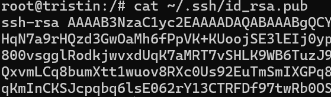
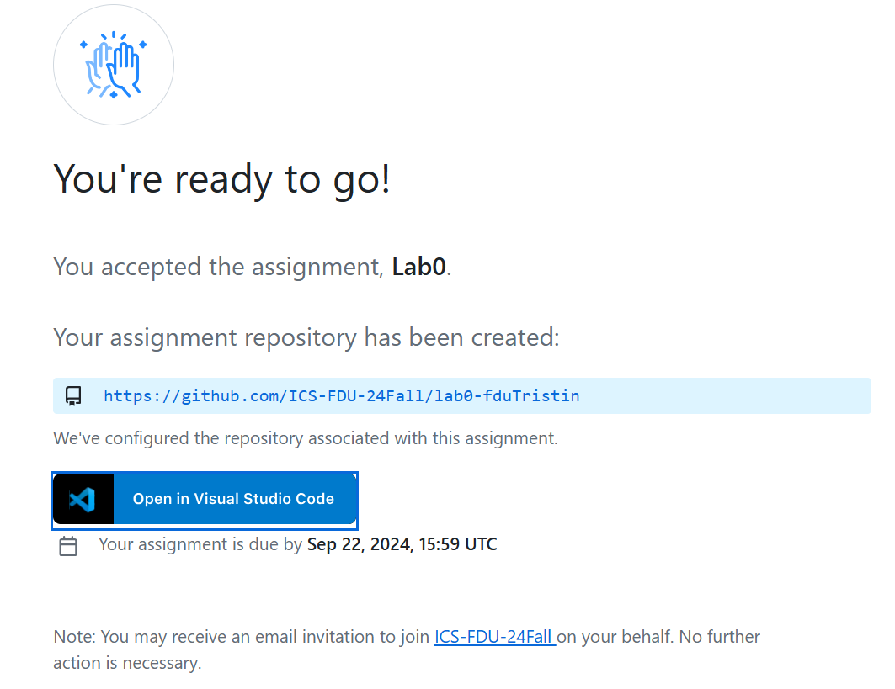

# Lab0 -- GitLab

## 实验介绍

* 你需要学会使用一些基本的git功能。
* ~~这个实验非强制性要求~~，但学会使用git是大有裨益的

## 实验指引

* git的安装
  
  * 参考这个[网站](https://git-scm.com/book/zh/v2/%E8%B5%B7%E6%AD%A5-%E5%AE%89%E8%A3%85-Git)

* 你需要注册一个[github](https://github.com/)账号
* github配置 **ssh key**

  **NOTE:** 由于我们的实验都在虚拟机linux环境下进行，所以无需为本地主机配置ssh key。如果你以后希望将本地的仓库推送到远程，只要在本地的终端进行下面的配置。
  * 1.打开wsl
  * 2.检查是否已经存在ssh key。终端运行

    ```shell
    cd ~/.ssh
    ls
    ```

    如果输出如下：

    

    则跳到第4步

  * 3.生成 ssh key。终端运行

    ```shell
    ssh-keygen -t rsa -C "xxx@xx.com"
    # 引号以及里面的内容替换为你的邮箱
    # 执行后一直回车即可
    ```

  * 4.获取ssh key 公钥内容(id_rsa.pub)

    ```shell
    cat ~/.ssh/id_rsa.pub
    # cat命令用于连接文件并打印到标准输出设备
    ```

    如下图所示：

    

    复制该内容（从ssh-rsa开始）
  
  * 5.github账号上添加公钥
    * 点击进入settings-SSH and GPG keys

    

    * 点击"New SSH keys"，将刚刚复制的公钥粘贴，并给它起个名字，例如wsl-key
  * 6.验证是否成功

    

* 进入课堂

  * 点击加入[github classroom](https://classroom.github.com/a/VxWMuuOe)

  * 你将显示如下页面：

  

  * 选择和你对应的学号/姓名

  * 完成后：

  

  * 这个链接是你的远程仓库（你只能访问自己的，需要保持github的登录状态）

* 创建本地仓库（你也可以直接点进链接，直接更新远程仓库，但是推荐使用本地仓库）
  * 打开wsl，新建一个lab文件夹

    ```shell
    cd ~
    # 进入默认文件夹
    mkdir lab0
    # 创建名为lab0的文件夹（你也可以在此之前创建一个总的课程文件夹，进入之后创建每个lab的文件夹）
    cd lab0
    # 进入lab0文件夹
    ```
  
  * 在网页中访问刚刚获取的链接，点击"Code"下的"SSH"，复制

    

  * 运行

  ```shell
  git clone xxxx
  # (将xxxx替换为刚刚获取的SSH)
  # git clone指令用于将远程仓库克隆到本地
  ```

    

  你会发现当前目录下有一个文件夹
    

* 修改本地仓库（vscode打开）
  
  * 你只需要成功上传一个文件，可以是任何内容（例如一个简单的helloworld.c，或是对本课程的期待？）（但最好不要是.doc/.docx文件）

* 上传！
  * 你需要先在终端进入克隆下来的文件夹
    

  * 在终端运行以下指令：

    ```shell
    git add -A
    # 提交当前文件夹下的所有更改到暂存区
    git commit -m "xxx(可以是你的提交注释)"
    # 将暂存区的所有更改提交到本地仓库
    git push
    # 将本地仓库推送到远程
    ```

  * 你也可以使用vscode自带的提交功能

## #参考资料

* [github classroom的使用](https://www.bilibili.com/video/BV12L41147r7?vd_source=4c29bc15f944e68c9ed01279da29e70e)

* 更多的git操作可以参考lab文档下的`Git 基本使用`或这个[链接](https://www.fducslg.com/git-and-github/)